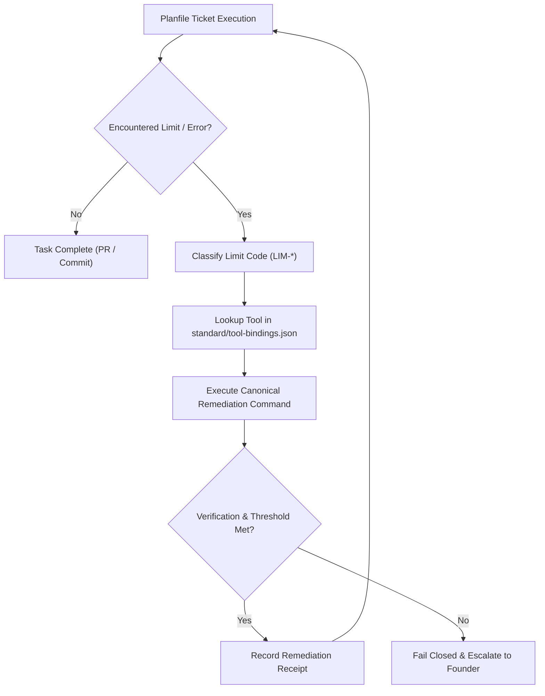

# Wellmanifest NoLimits

Standard for classifying, diagnosing, and unblocking host execution limits during autonomous task delivery from a `planfile`.

When an autonomous agent or host runner (e.g. Koru, Subactor, Antigravity) works through tickets in a `planfile`, physical, runtime, and governance limits frequently stall execution: disk space runs out (`ENOSPC`), test suites balloon into thousands of redundant checks, PRs get stuck waiting for external review, or dirty git working trees cause collision errors.

**The Wellmanifest NoLimits Standard** (`wellmanifest/nolimits@v1`) eliminates ad-hoc interventions by formalizing:
1. **The 10 Host Execution Limits (`LIM-*`)**: A deterministic catalog of barriers.
2. **Canonical Tool Bindings**: Direct mappings to dedicated `semcod/*` and `wellmanifest/*` remediation utilities.
3. **Automated Recovery Protocol**: How an agent detects a barrier, triggers the canonical tool, verifies capacity restoration, and immediately resumes the planfile ticket without human stalling.

---

## The 10 Host Execution Limits & Tool Bindings

| Code | Limit Name | Dimension | Threshold | Remediation Tool | Canonical Action |
|:---|:---|:---|:---|:---|:---|
| `LIM-STORAGE-001` | **Storage Exhaustion** | Disk / FS | Free disk < 10 GB or `ENOSPC` write error | [`semcod/fixos`](https://github.com/semcod/fixos) | `fixos cleanup --threshold-gb 10` & `fixos quick` (cleans stale caches, old container layers, and logs) |
| `LIM-TEST-002` | **Test Bloat & Slow Verification** | Testing | Suite run > 5m or test count > 1000 | [`semcod/testless`](https://github.com/semcod/testless) | `testless scan -s <pkg> <tests>` & `testless doctor` (eliminates zero-unique-coverage tests, scopes runs) |
| `LIM-MERGE-003` | **Merge Pipeline Lock** | Governance | PR blocked on missing independent review or protected admission | [`subactor/validator-agent`](https://github.com/subactor/validator-agent) | Enforce independent Validator review and admission under `wellmanifest/merge@ticket-012/013` (rejects admin bypass / self-review rotation) |
| `LIM-WORKTREE-004` | **Dirty Primary / Branch Collision** | Git | Primary git status dirty or branch conflict | [`wellmanifest/worktrees`](https://github.com/wellmanifest/worktrees) | Allocate isolated worktree `<primary>/.worktrees/ticket-NNN--desc` via `conformance.py` lease |
| `LIM-DEPENDENCY-005` | **Dependency / Venv Mismatch** | Environment | `ModuleNotFoundError` or broken virtualenv | [`semcod/pactfix`](https://github.com/semcod/pactfix) / `uv` | Reconcile lockfile with `pactfix reconcile` and execute under target `.venv/bin/python` |
| `LIM-RESOURCE-006` | **Resource Starvation / Zombies** | CPU / RAM | Host load > CPU count or RAM < 500 MB | [`wellmanifest/hostguard`](https://github.com/wellmanifest/hostguard) + `fixos` | `hostguard classify` + `fixos "zlap bledy w systemie"` (terminates orphaned background test runners) |
| `LIM-CONTEXT-007` | **LLM Context Window Overflow** | LLM Tokens | Prompt > 80% context or truncated log | [`semcod/code2llm`](https://github.com/semcod/code2llm) | Distill code into AST outlines with `code2llm` or delegate sub-tasks to subagents |
| `LIM-FLAKY-008` | **Flaky Test Regression** | Reliability | Test fails intermittently without code edits | [`semcod/testwins`](https://github.com/semcod/testwins) | `testwins isolate --quarantine-flaky` (records quarantine receipt, unblocks sprint progress) |
| `LIM-GOVERNANCE-009` | **Governance Gate Rejection** | Compliance | `governance-check.sh` rejects (`GOV-*`) | [`wellmanifest/new-project`](https://github.com/wellmanifest/new-project) | Update `intent.json` / component scope via `./project/new-ticket.sh --amend` |
| `LIM-COST-010` | **API Quota & Cost Depletion** | Budget | LLM HTTP 429 rate limit or token quota exhausted | [`semcod/costs`](https://github.com/semcod/costs) + `swop` | Check budget with `costs report`, retry with bounded backoff or rotate LLM fallback provider (does not apply to CI billing) |

---

## Remediation Workflow for Planfile Execution

When a planfile executor encounters a barrier:



### Example: Storage Limit Encountered (`LIM-STORAGE-001`)
1. **Trigger**: During a test run or worktree creation, the host detects available space < 10 GB (or gets `ENOSPC: No space left on device`).
2. **Lookup**: Match `LIM-STORAGE-001` in `tool-bindings.json` -> Tool: `semcod/fixos`.
3. **Execution**:
   ```bash
   fixos cleanup --threshold-gb 10
   fixos quick
   ```
4. **Verification**: Verify `df -h /` reports >= 10 GB free.
5. **Resume**: The agent logs a `wellmanifest.nolimits/report/v1` receipt and resumes the planfile ticket immediately.

---

## Conformance Verification

Verify that the standard's tool bindings, schema, and decision rules are sound:

```bash
python3 standard/conformance.py
```

The suite validates:
- Schema completeness for all 10 `LIM-*` codes.
- Deterministic bindings to `semcod/*` and `wellmanifest/*` tools.
- Admissibility evaluation across multiple simulated failure and recovery scenarios.
